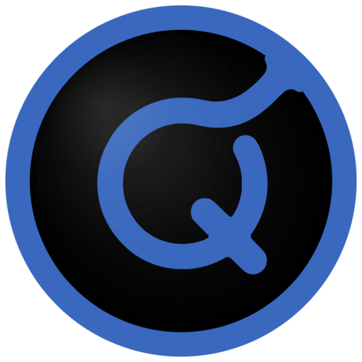
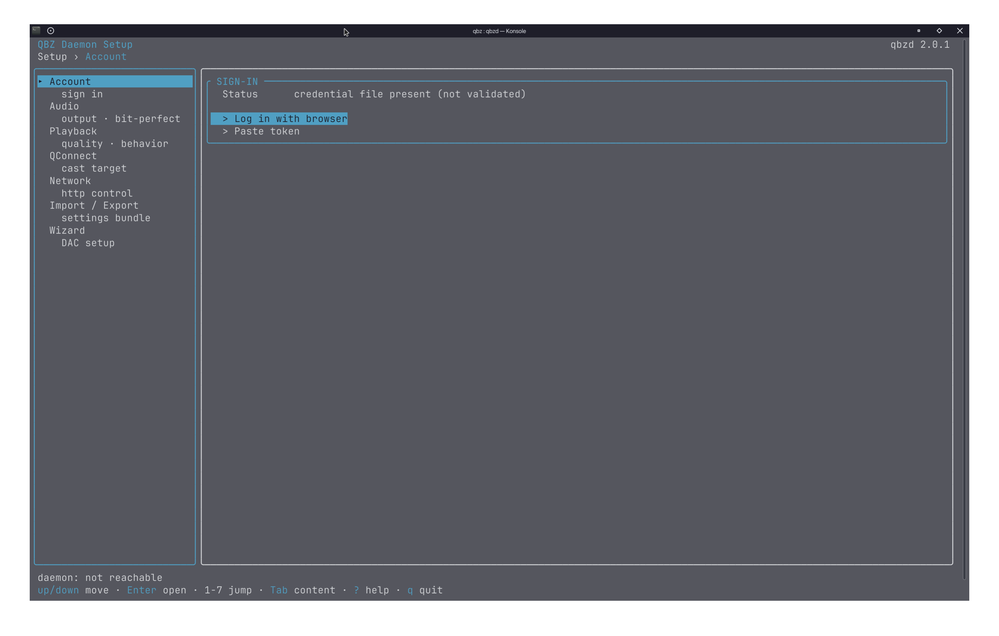
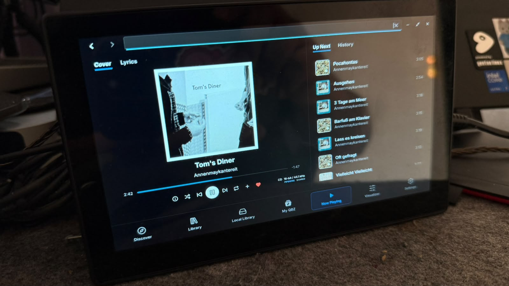

<p align="center">
  
</p>

<p align="center">
  <a href="https://github.com/vicrodh/qbz"></a>
  <a href="https://github.com/vicrodh/qbz/releases"></a>
  <a href="https://aur.archlinux.org/packages/qbz-bin"></a>
  <a href="https://snapcraft.io/qbz-player"></a>
  <a href="https://flathub.org/apps/com.blitzfc.qbz"></a>
  <a href="https://github.com/vicrodh/qbz"></a>
  <a href="https://github.com/vicrodh/qbz"></a>
  <a href="https://github.com/vicrodh/qbz"></a>
  <a href="https://github.com/vicrodh/qbz/releases"></a>
</p>

<p align="center">
  <a href="https://techforpalestine.org/learn-more"></a>
</p>

# QBZ

QBZ is a free and open source HiFi music player. Originally built only for
Linux, it is now also available for macOS and Windows (experimental). The
application started as a Qobuz client for paying subscribers who wanted to
listen without the audio quality limits of web browsers. Its strengths were
DAC passthrough, sending audio directly to the DAC or sound card, and switching
sample rates for each track, all with a focus on bit-perfect audio delivery.

QBZ has always played both your Qobuz subscription and your local files.
Local playback was initially an extra; it has since become just as capable.
QBZ also supports self-hosted music through Plex, Jellyfin and
Subsonic/Navidrome, all through the same interface and the same audio pipeline.

The application requires no API keys, token extraction or anything like that.
It has zero telemetry, with opt-in integrations for scrobbling, metadata
enrichment and Discord Rich Presence. QBZ doesn't track you. It just plays
your music.

## Contents

<table>
<tr>
<td width="50%" valign="top">

- [What QBZ is and what it is not](#what-qbz-is-and-what-it-is-not)
- [Legal and branding](#legal-and-branding)
- [Installation](#installation)
- [Features](#features)
- [Headless daemon (qbzd)](#headless-daemon-qbzd)
- [Kiosk mode](#kiosk-mode)
- [Tech stack](#tech-stack)
- [Building from source](#building-from-source)

</td>
<td width="50%" valign="top">

- [Environment variables](#environment-variables)
- [Known issues](#known-issues)
- [Reporting a problem](#reporting-a-problem)
- [On LLMs and AI tools](#on-llms-and-ai-tools)
- [Documentation](#documentation)
- [Contributing](#contributing)
- [License](#license)

</td>
</tr>
</table>

## What QBZ is and what it is not

QBZ exists to fill the gap left by the lack of an official Linux client.
Although it is available on other platforms, QBZ will always be Linux first.
I believe Linux users are not second-class citizens, and we deserve software
that works, looks good and, every now and then, is easy to use.

But it is just as important to understand what QBZ is not. QBZ is not a
stream-ripping tool. Its purchase downloader lets you download music you have
bought on Qobuz, and only your purchases can be downloaded DRM-free. I built
QBZ rather than TDL, SPTFY, DZR or PPLMSC out of love for music, because I
believe it belongs to the artists who create it, and because Qobuz is perhaps
the fairest platform for artists so far.

You can keep tracks from the service for offline listening and access them
through your library. These are protected with QBZ's own encryption and cannot
be used outside the application. Offline listening remains subject to your
subscription: if Qobuz reports that it is no longer valid, QBZ allows a 30-day
grace period from that first invalid response, then removes the cached tracks
unless the subscription has been validated again.

QBZ will never be an all-in-one audio system with a built-in equalizer,
spatial filters, DSP or similar processing. The point is to send audio to your
DAC, or whichever output you prefer, untouched, bit for bit. Any processing
would break that contract. Of course, you can configure your output so that
once the music leaves QBZ, it goes wherever you want, including an EQ such as
EasyEffects. PipeWire and JACK make that easy.

Above all, I'm a software engineer, not an audio engineer. I can't ship
something when I don't understand how it works. I can't take responsibility
for an EQ copied from somewhere else or written by an AI model without being
sure I can test it and verify that it works 100%. I already did that with
another module, and it didn't go well.

## Legal and branding

- This application uses the Qobuz API but is not certified by Qobuz.
- Qobuz is a trademark of Qobuz. QBZ is not affiliated with, endorsed by, or
  certified by Qobuz.
- **Offline cache** is a temporary playback store for listening without an
  internet connection, protected with QBZ's own encryption. It is not a
  DRM-free download of music from your subscription.
- **Local library** is a "bring your own music" feature — play your own files
  with bit-perfect audio and the full QBZ interface, no streaming subscription
  required.
- **SACD images** are user-supplied local files. QBZ does not provide disc
  images or tools to bypass SACD copy protection.
- **SACD / DST decoding** uses `dst-decoder` 0.1.2 solely to decode MPEG-4
  Direct Stream Transfer audio. The crate declares Apache-2.0 and is based
  on the MPEG-4 DST reference implementation. QBZ includes the
  [Apache license](licenses/Apache-2.0-dst-decoder.txt),
  [provenance notice](licenses/dst-decoder-NOTICE.md) and
  [full upstream MPEG notice](licenses/dst-decoder-upstream-NOTICE.txt),
  including its patent notice, with its third-party licenses. QBZ does not
  claim worldwide patent clearance.
- Qobuz Terms of Service: https://www.qobuz.com/us-en/legal/terms

## Installation

### Arch Linux (AUR)

Install the prebuilt packages (recommended):

```bash
yay -S qbz-bin     # desktop player; or: paru -S qbz-bin
yay -S qbzd-bin    # optional headless daemon; or: paru -S qbzd-bin
```

To build from source instead:

```bash
yay -S qbz         # desktop player; or: paru -S qbz
yay -S qbzd        # optional headless daemon; or: paru -S qbzd
```

Pick either the source or `-bin` variant in each pair; both variants provide
the same package and therefore conflict with each other.

### Flatpak (Flathub)

```bash
flatpak install flathub com.blitzfc.qbz
```

> **Audiophiles:** bit-perfect works in Flatpak. The sandbox needs one
> permission grant so QBZ can ask PipeWire to hand the DAC over cleanly (D-Bus
> device reservation) — without it PipeWire keeps holding the device and other
> apps keep mixing through it, even with exclusive mode selected:
>
> ```bash
> flatpak override --user --own-name=org.freedesktop.ReserveDevice1.* com.blitzfc.qbz
> ```
>
> QBZ shows this and the other sandbox grants under **Settings → Flatpak** with
> copyable commands, and the HiFi Wizard covers the rest. Your host audio stack
> still has to be configured correctly.

### Snap

```bash
sudo snap install qbz-player
sudo snap connect qbz-player:alsa
sudo snap connect qbz-player:pipewire
```

> **Note:** After installing, connect ALSA and PipeWire interfaces for full
> audio support. MPRIS media keys work out of the box.

### APT (Debian / Ubuntu / Mint)

```bash
curl -fsSL https://vicrodh.github.io/qbz-apt/qbz-archive-keyring.gpg | gpg --dearmor | sudo tee /usr/share/keyrings/qbz-archive-keyring.gpg > /dev/null
cat <<EOF | sudo tee /etc/apt/sources.list.d/qbz.sources
Types: deb
URIs: https://vicrodh.github.io/qbz-apt
Suites: stable
Components: main
Architectures: $(dpkg --print-architecture)
Signed-By: /usr/share/keyrings/qbz-archive-keyring.gpg
EOF
sudo apt update && sudo apt install qbz
```

> **x86_64:** glibc 2.35+ (Ubuntu 22.04+, Debian 12+, Mint 21+).
> **arm64 (desktop app):** glibc 2.39+ (Ubuntu 24.04+, Debian 13+) — the Qt
> arm64 build needs it; Raspberry Pi OS *bookworm* is 2.36, so use `qbzd`
> there (2.35+, see below). For older systems, check Flatpak or Snap runtime
> support. The arm64 AppImage has the same glibc 2.39 minimum as the native
> packages.

### RPM (Fedora / openSUSE)

Add the signed QBZ repository and install with DNF:

```bash
sudo curl --fail --location \
  --output /etc/yum.repos.d/qbz.repo \
  https://vicrodh.github.io/qbz-rpm/qbz.repo
sudo dnf install qbz       # desktop player, including qbzd
# or: sudo dnf install qbzd  # headless daemon only
```

On openSUSE, use the same repository definition with Zypper:

```bash
sudo curl --fail --location \
  --output /etc/zypp/repos.d/qbz.repo \
  https://vicrodh.github.io/qbz-rpm/qbz.repo
sudo zypper refresh qbz
sudo zypper install qbz    # or: sudo zypper install qbzd
```

The signing-key fingerprint is published on the
[repository landing page](https://vicrodh.github.io/qbz-rpm/). Individual RPM
files also remain available from [Releases](https://github.com/vicrodh/qbz/releases).

> **x86_64:** glibc 2.35+ (Fedora 36+, openSUSE Leap 15.6+ / Tumbleweed).
> **arm64 (desktop app):** glibc 2.39+ (Fedora 40+). `qbzd` packages stay at
> 2.35+ on both architectures.

### Gentoo

```bash
eselect repository add qbz-overlay git https://github.com/vicrodh/qbz-overlay.git
emerge --sync qbz-overlay
emerge media-sound/qbz-bin    # prebuilt binary (recommended)
# or
emerge media-sound/qbz        # build from source
```

For a headless installation, choose the matching daemon package:

```bash
emerge media-sound/qbzd-bin   # prebuilt binary (recommended)
# or
emerge media-sound/qbzd       # build from source
```

`qbzd` does not require systemd. The ebuild detects systemd, OpenRC or runit
and prints the appropriate post-install command; the daemon can generate
service definitions for all three init systems.

### NixOS / Nix

Add the flake input to your `flake.nix`:

```nix
inputs.qbz.url = "github:vicrodh/qbz";
```

**NixOS (system-wide):**

```nix
{pkgs, inputs, ...}:
{
  environment.systemPackages = [
    inputs.qbz.packages.${pkgs.system}.default
  ];
}
```

**Home Manager:**

```nix
{pkgs, inputs, ...}:
{
  home.packages = [
    inputs.qbz.packages.${pkgs.system}.default
  ];
}
```

> QBZ is also available in [nixpkgs](https://github.com/NixOS/nixpkgs) as `qbz`.

### AppImage

Download from [Releases](https://github.com/vicrodh/qbz/releases):
`chmod +x QBZ.AppImage && ./QBZ.AppImage`

### macOS

**QBZ is Linux-first, but macOS is a stable, fully supported platform** — a
proper player for Linux and Mac. PipeWire, ALSA and JACK are Linux-specific
backends; macOS plays through its own CoreAudio backend, including a Core Audio
Direct passthrough path for bit-perfect output. Casting (Chromecast/DLNA) and
Qobuz Connect work on macOS as well.

**Recommended — signed and notarized:** Afonso Ramos independently maintains a
[Homebrew Cask](https://github.com/afonsojramos/homebrew-qbz), which installs
without requiring a manual Gatekeeper bypass:

```bash
brew install --cask afonsojramos/qbz/qbz
```

You can also download the Apple Silicon or Intel DMG from the
[signed macOS releases](https://github.com/afonsojramos/qbz-macos/releases/latest).
These builds use the upstream QBZ application without recompiling it:
[@afonsojramos](https://github.com/afonsojramos) replaces its ad-hoc signature
and DMG container, then notarizes the result. This community-maintained signing
and distribution is the recommended way to install QBZ on macOS, and the macOS
version would likely not exist in its current form without Afonso's work. The
mirror publishes the source commit, original checksums, and signed checksums
for each release; see its
[trust and provenance documentation](https://github.com/afonsojramos/qbz-macos#trust-and-provenance).

**Official upstream alternative — ad-hoc signed, not notarized:** if you prefer
the artifact produced directly by the QBZ project, download the Apple Silicon
or Intel DMG from [QBZ Releases](https://github.com/vicrodh/qbz/releases) and
drag QBZ into Applications. Because the project has no Apple Developer
subscription, Gatekeeper blocks its first run. On recent macOS versions
(Sequoia / 15 and later), unlock it using either route:

- **Settings route:** try to open QBZ once (it gets blocked), then go to
  **System Settings → Privacy & Security**, scroll down to the message that
  QBZ was blocked, and click **Open Anyway**.
- **Terminal route** (what the settings toggle does, minus the clicking):

  ```bash
  xattr -dr com.apple.quarantine /Applications/QBZ.app
  ```

  This removes the quarantine attribute macOS stamps on downloaded files —
  it's a one-time unlock for this copy of the app; updates installed through
  QBZ's own updater don't need it again.

## Features

### Audio and playback

- **Bit-perfect playback** with DAC passthrough and per-track sample rate
  switching (44.1–192 kHz)
- **Linux backends:** PipeWire, ALSA (with a Direct `hw:` bypass mode),
  PulseAudio and JACK — PipeWire and PulseAudio work out of the box
- **macOS backend:** CoreAudio, including a Core Audio Direct passthrough path
  for bit-perfect output
- **HiFi Wizard** — hardware auto-detection and a guided bit-perfect setup
- Native decoding: FLAC, MP3, AAC, ALAC, WavPack, Ogg Vorbis, Opus (Symphonia)
- **DSD support** — DSF/DFF playback with DSD-to-PCM conversion, DoP, and
  native DSD passthrough (ALSA)
- **CD and SACD playback** — audio CDs and SACD discs play directly from the
  drive; SACD goes out over DoP, with the titles read from the disc
- **CD ripping to FLAC** — a guided rip wizard with per-track progress
- Gapless playback on all backends
- **Loudness normalization** (EBU R128) with ReplayGain support
- Two-level audio cache with next-track prefetching
- Streaming playback — start listening before the download completes

### Your music, wherever it lives

QBZ treats every source the same way: one queue, one player, one interface.

- **Qobuz** — your subscription, favourites, playlists and purchases
- **Local files** — directory scanning, metadata extraction, CUE sheets and a
  SQLite catalog; usable without ever logging into Qobuz
- **Plex** — browse and play your Plex music library
- **Jellyfin** — browse and play your Jellyfin music library
- **Subsonic / Navidrome** — any Subsonic-compatible server
- **Optical discs** — CD and SACD, played or ripped

### Queue and library

- Queue with shuffle, repeat (track/queue/off) and history
- Favorites and playlists from your Qobuz account
- **Qobuz playlist follow/unfollow** — subscribe natively, syncs across all
  Qobuz clients
- **Playlist manager** with folders and tags, plus playlist import from
  Spotify, Apple Music, Tidal and Deezer
- **Artist/album blacklist** — block artists or individual albums, not just
  genres; fully reversible
- **Metadata editor** — a full tabular editor for your local files, with
  MusicBrainz and Discogs lookup, album art from local files or from
  Cover Art Archive / Discogs / Last.fm, and a sidecar mode that leaves your
  original files untouched
- Virtualized lists for large libraries

### Qobuz Connect

Multi-device playback control using Qobuz's real-time streaming protocol. Full
1:1 parity with the official clients is still in progress.

- **Renderer mode** — receive playback commands from your phone, tablet or web
  player
- **Controller mode** — control remote devices from QBZ
- Server-authoritative queue sync across all devices
- Bidirectional transport: play, pause, skip, seek, shuffle, repeat, volume

### Casting

- **Chromecast** and **DLNA/UPnP** discovery and streaming
- Seamless playback handoff to network devices

### Integrations

- **MPRIS** media controls and media keys
- **Last.fm** scrobbling and now-playing
- **ListenBrainz** scrobbling with offline queue
- **MusicBrainz** artist enrichment, musician credits, relationships (no
  telemetry — one-way pull)
- **Discogs** artwork and metadata for the local library
- Desktop notifications with artwork
- **Listening history** is stored only on your disk, per Qobuz account; it
  never leaves the machine unless you enable a scrobbler (Settings ›
  Integrations › Privacy to pause or clear it)

### Immersive player

- Full-screen player with a tabbed panel system
- Multiple full-bleed view modes — Album Reactive, Coverflow, Static, Spectrum,
  Wave Bed, Lyrics — plus GPU shader scenes (Plasma, Tunnel, Aurora, Spectral
  Ribbon, Line Bed)
- **Search overlay works inside Immersive mode** — switch albums without
  leaving the view
- Synchronized lyrics with line-by-line display
- Split-panel layouts: Lyrics, Track Info, Suggestions, Queue

### Discovery

- **Scene Discovery** — explore artists by location and musical scene
  (MusicBrainz-powered)
- **3-tab Home:** customizable Home, Editor's Picks, personalized For You
- **Recommendations** — Last.fm and ListenBrainz/MusicBrainz-powered discovery
  based on your listening history, similarities and local-listen vectorization
- **Live search overlay** with a small cache layer that learns your preferences
  and stops surfacing results you never touch
- Genre filtering, artist similarity engine, radio stations
- Musician pages, label pages, album credits

### Interface

- 30+ themes (Dark, OLED, Nord, Dracula, Tokyo Night, Catppuccin, Breeze,
  Adwaita...) plus a custom theme editor
- Auto-theme from DE, wallpaper, or custom image
- Mini player and system tray
- Album booklets download to your device
- Configurable keyboard shortcuts, UI scale presets (XS–XL)
- **8 languages:** English, Spanish, German, French, Portuguese, Russian,
  Japanese, Dutch
- **Offline mode** usable without ever logging into Qobuz, with fully offline
  playlists and automatic reconnection

## Headless daemon (qbzd)

<p align="center">
  
</p>

Run QBZ without a screen: `qbzd` is a standalone ~25 MB binary (shipped inside
the deb/rpm packages and as its own tarball) that turns any Linux box — a
Raspberry Pi, a NAS, the living-room mini-PC — into a bit-perfect **Qobuz
Connect endpoint** that appears in the official Qobuz apps like a hardware
streamer. It needs only **glibc 2.35+ on x86_64 and arm64** (Raspberry Pi OS
*bookworm* and *trixie*, 1 GB boards included) — deliberately lower than the
arm64 desktop app's 2.39, so a trimmed Pi image stays a valid target.

- Daemon + full CLI + terminal setup wizard (TUI) in one binary
- Browser-based login that works over SSH; one-file settings hand-off from
  desktop QBZ
- HiFi wizard with copyable audio-stack config blocks (clipboard works over SSH)
- MPRIS out of the box, live JSON events (`qbzd watch`), service files for
  systemd/OpenRC/runit
- Event hooks: `qbzd settings set hooks.script /path/to/script` runs your script
  on playback/session events with `QBZ_*` environment variables — push
  integration for audio-box distros (moOde, Volumio, DIY setups), no polling
  required

Full manual:
**[Headless Daemon (qbzd) — Wiki](https://github.com/vicrodh/qbz/wiki/Headless-Daemon)**

## Kiosk mode

For Raspberry screens and handheld consoles.

<p align="center">
  
</p>

A touch-first face for touchscreens and small panels: set `QBZ_PROFILE=kiosk`
and QBZ boots a big-target shell with its own NavRail, touch scrolling, an
on-screen keyboard, and a centerpiece Now Playing with cover↔lyrics toggle and
queue/history tabs. Switch between Kiosk and Desktop live from the Now Playing
layout menu; fullscreen is opt-in via `QBZ_KIOSK_FULLSCREEN=1`.

## Tech stack

QBZ is a single native Rust process. The UI is **Qt/QML**, bound to the Rust
core through [cxx-qt](https://github.com/KDAB/cxx-qt): the QML scene graph and
the Rust backend live in the same process and talk through generated QObject
bridges — there is no browser engine, no webview and no IPC boundary to
serialize across.

| Layer | Technology |
|-------|-----------|
| **Desktop shell + UI** | Qt 6 / QML via cxx-qt (native, single process — no webview, no IPC) |
| **Custom rendering** | Qt RHI scene-graph items + baked `.qsb` shaders (visualizers, immersive scenes, waveform) |
| **Audio decoding** | Symphonia (all codecs) via rodio |
| **Audio backends** | Linux: PipeWire, ALSA (alsa-rs, incl. Direct `hw:`), PulseAudio, JACK. macOS: CoreAudio (incl. Core Audio Direct) |
| **Networking** | reqwest (rustls-tls) |
| **Database** | rusqlite (bundled SQLite, WAL mode) |
| **Desktop** | mpris-server (Linux MPRIS), souvlaki (macOS media controls), ksni (Linux tray), keyring |
| **Casting** | rust_cast (Chromecast), rupnp (DLNA/UPnP), mdns-sd |
| **i18n** | qbz-i18n, gettext-style `.po` bundles compiled into the binary (8 locales) |

### Multi-crate architecture

The Rust workspace lives entirely under `crates/` (manifest
`crates/Cargo.toml`). `qbz-qt` is the application crate — it owns the QML tree,
the cxx-qt bridges and the RHI items, and produces the `qbz` binary. Everything
below it is frontend-agnostic. A representative slice of the workspace:

```
crates/
  qbz-qt/                Application crate: QML tree, cxx-qt bridges, RHI items
  qbz-app/               Application-level orchestration (non-UI)
  qbz-core/              Orchestrator (player + audio + API)
  qbz-models/            Shared domain types
  qbz-theme/             Theme engine (30+ themes)
  qbz-i18n/              Bundled translations (8 locales)

  qbz-audio/             Audio backends, loudness, device management
  qbz-player/            Playback engine, streaming, queue
  qbz-dsd/               DSD (DSF/DFF) decoding, DoP, native DSD packing
  qbz-disc/              Optical media: CD-DA and SACD
  qbz-rip/               CD ripping to FLAC
  qbz-cmaf/              CMAF/DASH streaming
  qbz-cache/             L1 memory + L2 disk audio caching
  qbz-offline-cache/     Offline downloads and their lifecycle

  qbz-qobuz/             Qobuz API client and auth
  qbz-source/            Source-agnostic seam over every backend
  qbz-library/           Local file scanning and metadata
  qbz-local-catalog/     Derived read projection for the local library
  qbz-plex/              Plex integration
  qbz-jellyfin/          Jellyfin integration
  qbz-subsonic/          Subsonic / Navidrome integration
  qbz-media-cache/       Shared cache for remote media servers

  qbz-integrations/      Last.fm, ListenBrainz, MusicBrainz, Discogs
  qbz-reco/ qbz-external-reco/  Recommendations engine
  qbz-lyrics/            Lyrics (Qobuz-native, external fallback)
  qbz-radio/             Radio stations
  qbz-mixtape/           Mixtape/DJ-mix generation
  qbz-playlist-import/   Spotify, Apple Music, Tidal, Deezer import
  qbz-media-controls/    MPRIS / SMTC / MPNowPlayingInfoCenter
  qbz-cast/              Chromecast, DLNA/UPnP
  qbz-dac-wizard-core/   HiFi Wizard (hardware auto-detection)
  qbz-credentials/ qbz-secrets/  Auth/token storage

  qconnect-protocol/     Qobuz Connect protobuf wire format
  qconnect-core/         Queue and renderer domain models
  qconnect-app/          Application logic and concurrency
  qconnect-transport-ws/ WebSocket transport with qcloud framing

  qbzd/                  Headless daemon + CLI + setup TUI
```

## Building from source

QBZ is a pure Rust workspace — there is no Node.js, no `npm install`, no
webview. The workspace manifest is `crates/Cargo.toml` and the application
crate is `qbz-qt`, which builds a binary called `qbz`.

### Prerequisites

- **Rust stable.** No nightly, no `mold`, no custom `RUSTFLAGS` — the build
  needs none of them, and setting any of them invalidates the whole build cache
  for no gain.
- **Qt 6.8 or newer** (6.9+ on Windows), including its development headers
  *and* the private headers (`<rhi/qrhi.h>` lives in Qt's private tree and the
  custom scene-graph items need it).
- **Python 3**, for the Qt SDK cache guard and QML audits.
- Linux, macOS or Windows x64 (experimental), with audio support.
- No Node.js/npm required.

### System dependencies

**Debian / Ubuntu:**

```bash
sudo apt install build-essential pkg-config cmake clang libclang-dev nasm python3 \
  qt6-base-dev qt6-base-private-dev \
  qt6-declarative-dev qt6-declarative-private-dev \
  qt6-shadertools-dev \
  libasound2-dev libjack-jackd2-dev libdbus-1-dev libssl-dev
```

`qt6-shadertools-dev` provides `qsb`, the shader baker. It is optional: the
`.qsb` files are committed, so a build without `qsb` simply keeps them (the
build prints a warning). You need it if you intend to modify a shader.

**Arch Linux:**

```bash
sudo pacman -Syu --needed base-devel git rust pkgconf cmake clang nasm python \
  qt6-base qt6-declarative qt6-svg qt6-wayland alsa-lib dbus openssl
```

If you manage Rust with rustup, omit `rust` from that command.
Also install a JACK development provider: `pipewire-jack` if you use PipeWire's
JACK support, or `jack2` for JACK itself. Keep the provider your system already
uses. Both supply the headers and `jack.pc`. Arch's Qt packages include the
private headers; use `QMAKE=/usr/bin/qmake6` if another Qt version is selected.
For shader editing, add `qt6-shadertools`.

**Gentoo:**

With the standard Gentoo compiler toolchain and a stable Rust toolchain
installed (`dev-lang/rust`, `dev-lang/rust-bin` or rustup):

```bash
sudo emerge --ask dev-vcs/git dev-build/cmake dev-lang/nasm dev-lang/python \
  virtual/pkgconfig '>=dev-qt/qtbase-6.8:6[gui,network,opengl]' \
  '>=dev-qt/qtdeclarative-6.8:6[network,opengl]' \
  '>=dev-qt/qtsvg-6.8:6' '>=dev-qt/qtwayland-6.8:6' \
  media-libs/alsa-lib virtual/jack sys-apps/dbus dev-libs/openssl
```

Keep the Qt modules on the same version and enable the USE flags for your
display session (`X` or `wayland`). The Qt packages include their private
headers. If `qmake6` is not on PATH, set `QMAKE` to the Qt 6 executable, usually
`/usr/lib64/qt6/bin/qmake`. For shader editing, add `dev-qt/qtshadertools:6`.

**NixOS / Nix:**

Use a development shell with a nixpkgs revision that provides Qt 6.8 or newer.
For a manual checkout, the build dependencies can be loaded without installing
QBZ or adding development libraries to the system configuration:

```bash
nix-shell -p rustc cargo python3 pkg-config cmake nasm \
  qt6.qmake qt6.wrapQtAppsHook qt6.qtbase qt6.qtdeclarative \
  qt6.qtsvg qt6.qtwayland alsa-lib libjack2 dbus openssl
```

The Qt setup hooks select `qmake` and expose the development headers. For
shader editing, add `qt6.qtshadertools`. When packaging the application, keep
`qt6.wrapQtAppsHook` so the installed binary can find its Qt plugins and QML
modules; see the [Nixpkgs Qt documentation](https://nixos.org/manual/nixpkgs/unstable/#sec-language-qt).

**Fedora and other Linux distributions:** package names differ; look for the
equivalents of the list above — a C/C++ compiler plus clang/libclang, cmake,
nasm, the Qt 6 Base and Declarative modules with their development *and*
private headers, Qt Shader Tools, and ALSA, JACK, D-Bus and OpenSSL development
headers. Please open a PR if you confirm exact package names for your distro.

**macOS:** Xcode Command Line Tools (`xcode-select --install`), a Rust
toolchain, and Qt 6 — Homebrew's `qt` is what the build is tested against
(`brew install qt`); the build script finds it at `/opt/homebrew/opt/qt`
without any `PATH` fiddling.

**Windows x64 (experimental):**

To compile and run against an installed Qt SDK instead of using the QBZ bundle,
install:

- Visual Studio 2022 Build Tools with **Desktop development with C++**,
  including the MSVC v143 x64 toolchain and a Windows 10 or 11 SDK.
- Rust stable for `x86_64-pc-windows-msvc`, Git, Python 3, CMake and NASM.
- Qt **6.9 or newer**, using the **MSVC 2022 64-bit** kit, with Qt Base,
  Declarative/Quick, SVG and the private headers. CI currently uses **6.9.3**.
  Qt Shader Tools is optional unless you are editing shaders.

Use Qt's installer or an existing SDK with that kit. QBZ's Windows build uses
MSVC throughout; select the matching [Qt for Windows kit](https://doc.qt.io/archives/qt-6.9/windows.html).
Open an **x64 Native Tools Command Prompt for VS 2022**, then start PowerShell
from it. In the repository root, adjust the SDK path and run:

```powershell
$env:QT_ROOT_DIR = 'C:\Qt\6.9.3\msvc2022_64'
$env:QMAKE = "$env:QT_ROOT_DIR\bin\qmake.exe"
$env:CMAKE_PREFIX_PATH = $env:QT_ROOT_DIR
$env:PATH = "$env:QT_ROOT_DIR\bin;$env:PATH"
$env:CARGO_TARGET_X86_64_PC_WINDOWS_MSVC_LINKER = "$env:VCToolsInstallDir\bin\Hostx64\x64\link.exe"
python scripts/qt-cargo.py build --release --manifest-path crates/Cargo.toml -p qbz-qt --target x86_64-pc-windows-msvc
.\crates\target\x86_64-pc-windows-msvc\release\qbz.exe
```

Keep the SDK's `bin` directory on PATH when running this build so Qt's DLLs
can be found. WiX and .NET are only needed to build the MSI installer.

### Build and run

On Linux and macOS:

```bash
git clone https://github.com/vicrodh/qbz.git && cd qbz
NORUN=1 ./scripts/qt-run.sh
./crates/target/release/qbz
```

A release build from scratch is on the order of ten minutes on a modern
desktop; incremental builds are a couple of minutes. The UI is QML and is
loaded at runtime, so a change that touches only `.qml` does not go through
`rustc` at all.

### The build script: `scripts/qt-run.sh`

The repo ships the build script we use ourselves. It runs the static QML audits
first (they catch the class of mistake `cargo check` cannot see — a missing
component, or a call to a bridge member that does not exist — in about a
second), then builds and executes the binary directly:

```bash
./scripts/qt-run.sh             # build (release) and run
DEBUG=1    ./scripts/qt-run.sh  # debug profile
NORUN=1    ./scripts/qt-run.sh  # build only
TEST=1     ./scripts/qt-run.sh  # also run the crate's tests
SMOKE=1    ./scripts/qt-run.sh  # offscreen smoke run instead of the GUI
NO_AUDIT=1 ./scripts/qt-run.sh  # skip the QML audits
JOBS=4     ./scripts/qt-run.sh  # cargo build jobs
```

It works on Linux and macOS.

Qt builds use `scripts/qt-cargo.py` to include the installed SDK's header
contents in the native build cache. This prevents mixing stale C++ objects
with new Qt headers after a system update, without deleting `target/` or
changing Rust optimization flags. For custom Cargo commands, use
`python3 scripts/qt-cargo.py build --release --manifest-path crates/Cargo.toml -p qbz-qt`
(or `test` instead of `build`). On Linux, the smoke uses an isolated profile
and private D-Bus session, and fails on early exits, including segmentation
faults. The CI runtime gate checks both debug and release.

### Nix / NixOS

`flake.nix` builds the same binary via `rustPlatform.buildRustPackage` with the
crate root at `crates/` — see the [NixOS / Nix](#nixos--nix) install section
above, or run `nix build` / `nix develop` directly from a checkout.

### API proxy

Last.fm, Discogs, Tidal, Spotify-import and MusicBrainz traffic goes through a
hosted Cloudflare Workers proxy (`qbz-api-proxy.blitzkriegfc.workers.dev`) that
holds all credentials server-side. Both pre-built releases and source builds use
it out of the box — **no API keys or `.env` file required**.

If you want to run against your own proxy (for development, or if you fork
QBZ), the proxy source lives at
[`vicrodh/qbz-api-proxy`](https://github.com/vicrodh/qbz-api-proxy). Deploy it
with `wrangler deploy` and then edit the `*_PROXY_URL` constants in
`crates/qbz-integrations/src/lastfm/client.rs`,
`crates/qbz-integrations/src/discogs/mod.rs`,
`crates/qbz-playlist-import/src/providers/tidal.rs` and
`crates/qbz-integrations/src/musicbrainz/client.rs` to point at your worker
before rebuilding.

## Environment variables

QBZ picks a working renderer at startup and reverts automatically if a forced
choice fails to produce frames, so there is normally nothing to configure. The
renderer can also be set from **Settings → Appearance**; the environment
variable overrides it for one launch.

| Variable | Effect |
|----------|--------|
| `QBZ_RENDERER=auto` (or `gpu`, `hardware`, `hw`) | Qt's default backend — the GPU path. This is the default |
| `QBZ_RENDERER=gl` | Force the OpenGL backend (`QSG_RHI_BACKEND=opengl`) on Linux. On macOS this resolves to Metal |
| `QBZ_RENDERER=software` (or `cpu`, `soft`) | Force the software renderer (`QT_QUICK_BACKEND=software`) — for VMs and broken GPU stacks |
| `QBZ_PROFILE=kiosk` | Boot the touch-first Kiosk shell (`desktop` for the normal one) |
| `QBZ_KIOSK_FULLSCREEN=1` | Start Kiosk mode fullscreen |

Qt's own variables (`QSG_RHI_BACKEND`, `QT_QUICK_BACKEND`, `QT_QPA_PLATFORM`,
`QT_SCALE_FACTOR`…) work as usual and take precedence over `QBZ_RENDERER`.

If QBZ fails to start, try `QBZ_RENDERER=software qbz` first.

## Known issues

- **Hi-Res seeking** — seeking in tracks above 96 kHz can take 10–20 s (the
  decoder must scan from the start). Use prev/next for instant navigation.
- **ALSA Direct** — exclusive access blocks other apps. Use your DAC's or
  amplifier's physical volume control.
- **DSD DoP / native mode** — seeking is disabled and volume is fixed while a
  DoP or native-DSD stream is active (any sample manipulation would corrupt the
  DSD stream). Convert-to-PCM mode has no such limits.
- **Multichannel DSD comes out as stereo** — DoP and native passthrough are
  two-channel by design (a DoP receiver is a stereo device). Multichannel
  sources therefore play through the convert-to-PCM path, which folds up to 5.1
  down to stereo (ITU-R BS.775, LFE dropped); 7.1 and above are not supported
  and the file will not load. SACD discs play their stereo area.

## Supporting QBZ

QBZ is deeply grateful for every sponsor and supporter. There is no premium
edition and no sponsor-only functionality; your support helps sustain the
project while the same complete app remains available to everyone. Starting
with QBZ 2.1.0, public sponsors and supporters are thanked by name in the
app's **About** dialog. Private or anonymous support remains unnamed — and is
just as appreciated.

## Reporting a problem

Having trouble with the app? Please report it in the
[issue tracker](https://github.com/vicrodh/qbz/issues).

What makes a problem solvable: a title that names the actual symptom, the logs,
and a screenshot when it is something you can see. QBZ ships a tool for the logs
so you don't have to go hunting for files — **Settings → Share logs**, pinned at
the bottom of the Settings sidebar, opens the in-app log viewer. From there you
can filter by level, search, copy the log with secrets redacted, or upload it and
get a link to paste into the issue.

## On LLMs and AI tools

This project started about two years ago. I wrote the first version in Python,
which is my main stack. Then it became my Rust learning project — most of the
logic was written by hand, as a hobby, a proof to myself of what I could build
and how much I could learn. It then sat frozen for a long time.

Then LLMs went mainstream. They helped me put a real UX on top of what I already
had, they unblocked problems I had never found the time for, and they compressed
work that, at the pace and the hours I could actually give it, would have taken
months — or would have left the project sitting in a folder on my NAS forever.

Somewhere along the way QBZ filled a gap, and that made it relevant. Paying
attention and caring about the details also means more responsibility, and more
responsibility means more transparency: the project started by hand, but the
amount of code I type myself today is minimal. That does not mean the code is
careless. It goes through the same standards I use in my day job — the real one
— it is under continuous improvement, and it is always open to comments,
suggestions, requests and issue reports.

Using AI tools does not mean I ask an LLM for every feature or change that
crosses my mind, and it does not mean every request for a change or a new
feature gets accepted without analysis. I go out of my way to avoid that rabbit
hole — have a look at the [issues](https://github.com/vicrodh/qbz/issues). So if
you come up with something new, help me by explaining it and justifying it. If I
don't understand it, it is very unlikely to go in, because I cannot measure it
or test it properly.

I know we all want a lot of things. But keeping this app from turning into
[The Homer](https://tenor.com/IeFy.gif) is real work.

Almost all of the documentation, except this README, is AI slop. Seriously,
help writing or improving it is welcome. I hate writing documentation, and
who doesn't?

If you have a problem using software built with AI tools, this software is
probably not for you.

## Documentation

User guides, audio configuration, integrations and troubleshooting:
**[QBZ Wiki](https://github.com/vicrodh/qbz/wiki)** (work in progress).

## Contributing

QBZ is MIT-licensed. No telemetry, no tracking, no hidden services. Built for
Linux and macOS audio enthusiasts.

Contributions welcome. Please read `CONTRIBUTING.md` before submitting issues or
pull requests.

### Contributors

- [@vorce](https://github.com/vorce)
- [@boxdot](https://github.com/boxdot)
- [@arminfelder](https://github.com/arminfelder)
- [@afonsojramos](https://github.com/afonsojramos) — macOS port
- [@GwendalBeaumont](https://github.com/GwendalBeaumont) — i18n
- [@AdamArstall](https://github.com/AdamArstall)
- [@Vudgekek](https://github.com/Vudgekek) — macOS audio
- [@DoubleGate](https://github.com/DoubleGate)
- [@hoyon](https://github.com/hoyon) — classical work grouping
- [@mxnix](https://github.com/mxnix) — Russian translation
- [@TerminalTilt](https://github.com/TerminalTilt) — Catppuccin themes
- [@Alexandre-Menigault](https://github.com/Alexandre-Menigault) — active lyrics wrapping
- [@MarkusAbtion](https://github.com/MarkusAbtion) — opt-in section navigation
- [@fengalin](https://github.com/fengalin) — crypto-provider test coverage
- [@luukvanderduim](https://github.com/luukvanderduim) — applied-filter visibility
- [@pbaart](https://github.com/pbaart) — Dutch translation
- [@b0bbywan](https://github.com/b0bbywan) — ALSA buffer sizing
- [@stshow](https://github.com/stshow) — DLNA strict-renderer casting
- [@Ronjar](https://github.com/Ronjar) — deb822 APT instructions
- [@eldios](https://github.com/eldios) — Nix packaging
- [@herder](https://github.com/herder) — Spotify-parity hotkeys and the Vim keymap
- [@PhilipVinc](https://github.com/PhilipVinc) — daemon event hooks
- [@Mazipani](https://github.com/Mazipani) — Chromecast X.509 v1 certificates
- [@RayneGit](https://github.com/RayneGit) — Wayland clipboard
- [@LuckyTheCoder](https://github.com/LuckyTheCoder) — macOS Liquid Glass icon

## License

MIT
